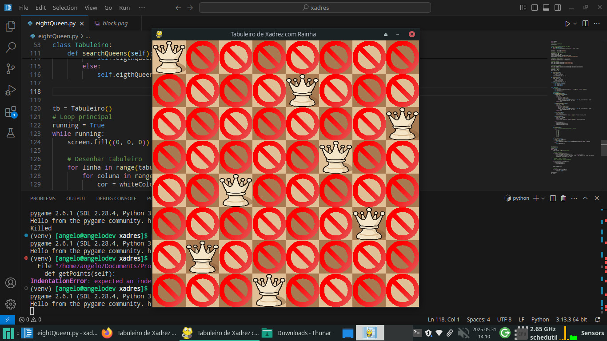

# ♛ Tabuleiro de Xadrez com 8 Rainhas (Pygame)

Este é um projeto em Python usando Pygame que renderiza um tabuleiro de xadrez 8x8 com a **solução do problema das 8 rainhas**. A solução é representada visualmente com imagens de rainhas e os blocos que elas atacam.

## 🧠 Sobre o problema das 8 rainhas

O objetivo do problema clássico das 8 rainhas é posicionar 8 rainhas em um tabuleiro de xadrez de forma que nenhuma rainha ataque outra. Ou seja:

- Nenhuma rainha pode estar na mesma linha, coluna ou diagonal de outra.

---

## 📷 Captura de Tela (Exemplo)

> Aqui você pode colocar uma imagem de exemplo do programa rodando (ex: screenshot.png).

---

## 📁 Estrutura do Projeto

```
.
├── main.py               # Código principal do jogo
├── assets/
│   ├── rainha.png        # Imagem da peça rainha
│   └── block.png         # Imagem do "ataque" da rainha
└── README.md             # Este arquivo
```

---

## ▶️ Como executar

1. Certifique-se de ter o Python 3 instalado.
2. Instale a biblioteca `pygame`:
   ```bash
   pip install pygame
   ```
3. Execute o programa:
   ```bash
   python main.py
   ```

---

## 🧩 Funcionalidades

- Geração de uma solução válida para o problema das 8 rainhas.
- Renderização gráfica do tabuleiro usando Pygame.
- Visualização das posições onde cada rainha pode atacar.

---

## 🎨 Cores

- Cores do tabuleiro são definidas via hexadecimal:
  - Casas claras: `#dfbf96`
  - Casas escuras: `#a77a51`

---

## 📌 Observações

- Atualmente, o código encontra **apenas a primeira solução válida** para o problema.
- A geração de soluções é feita por força bruta (aninhamento de 16 loops) e pode ser otimizada.
- O programa termina ao fechar a janela Pygame.

---

## 📜 Licença

Este projeto está sob a licença MIT. Sinta-se livre para usar, modificar e distribuir.


